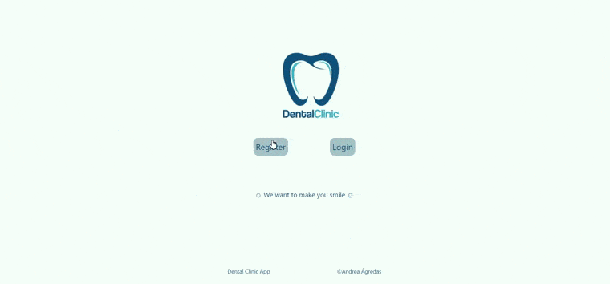
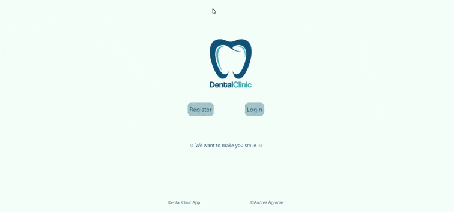

 # 🦷 AppDentalClinic 🦷

## Introduction

AppDentalClinic is an application for a Dental Clinic where clients can register and make appointments, cancel them or view them all, you can also be an administrator and see all the appointments of all the users.

- Links: 
  - Repository: [GitHub](https://github.com/Agredas/AppDentalClinicFrontend)
  - Deployed in: [Heroku](https://app-dental-clinic-frontend.herokuapp.com/)
  - Backend Repository: [Github](https://github.com/Agredas/AppDentalClinicBackend)

🔧Technologies🔨

- Javascript
- React
- NodeJS
- SCSS
- Axios
- Heroku
- MongoDB
- Atlas
- Git
- GitHub

## Functions as Client 🚀

Clients can register and make appointments, cancel them or view them all.

## Functions as Administrator 🚀

Administrator can login and view all appointments of all clients.

